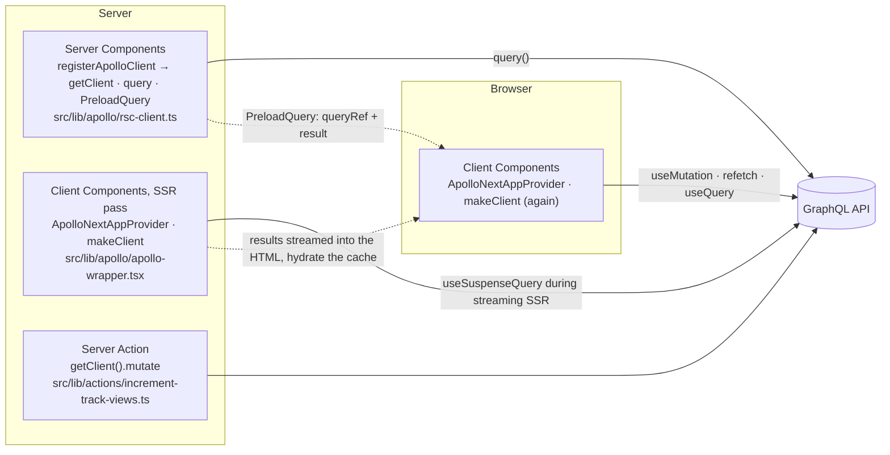

# Catstronauts on the Next.js App Router

The companion app of Odyssey's [Client-side GraphQL with React & Apollo](https://odyssey.apollographql.com/client-side-graphql-react) course, rebuilt on **Next.js 16 (App Router)** with **Apollo Client 4** and [`@apollo/client-integration-nextjs`](https://github.com/apollographql/apollo-client-integrations).

The course app is a Vite SPA that fetches everything with `useQuery` in the browser. This branch renders the same two pages (track catalog, track detail) **five times, one per data-fetching pattern**, so the patterns can be compared side by side on live data. Switch pattern from the header while staying on the same page and watch where the GraphQL request goes.

## Run it

```sh
pnpm install
pnpm dev          # http://localhost:3000
pnpm build && pnpm start
pnpm test         # vitest + testing-library
pnpm test:e2e     # playwright against a production build (pnpm build && pnpm start)
pnpm lint && pnpm typecheck
pnpm generate     # graphql-codegen against the live schema
```

The GraphQL endpoint defaults to the Odyssey Lift-off server. Override it with `NEXT_PUBLIC_GRAPHQL_URI` (see `.env.example`).

## The five patterns

| Route         | Pattern                                         | GraphQL request runs                          | HTML contains                     | Browser cache after load            | Mutation                             |
| ------------- | ----------------------------------------------- | --------------------------------------------- | --------------------------------- | ----------------------------------- | ------------------------------------ |
| `/rsc`        | `query()` from `registerApolloClient`           | On the server, during the RSC render          | Finished markup only              | Empty. RSC data never reaches it    | Server Action → `getClient().mutate` |
| `/suspense`   | `useSuspenseQuery` in a Client Component        | On the server during streaming SSR            | Markup + transported result       | Warm and live, no refetch           | `useMutation`                        |
| `/preload`    | `PreloadQuery` → `useSuspenseQuery` / `useReadQuery` | Started in RSC, consumed by Client Components | Markup + transported `queryRef`   | Warm and live, `refetch` available  | `useMutation`                        |
| `/background` | `useBackgroundQuery` + `useReadQuery`           | Server during SSR, like `/suspense`           | Markup + transported result       | Warm and live                       | `useMutation`                        |
| `/legacy`     | `useQuery` (the course way)                     | In the browser, after hydration               | Loading spinner                   | Warm after the client fetch         | `useMutation`                        |

Verify it yourself: `curl -s localhost:3000/rsc | grep Cat-stronomy` finds the data, `curl -s localhost:3000/legacy | grep progressbar` finds the spinner.

## How the pieces fit



Two Apollo Client instances exist on purpose:

- **RSC client** (`registerApolloClient`): one instance per request, memoized with React `cache()`, shared by every Server Component and Server Action in that request. Identical queries are deduplicated. `generateMetadata` and the page on `/rsc/track/[trackId]` both call `GetTrack`; only one request leaves the server.
- **Client Components client** (`ApolloNextAppProvider` + `makeClient`): created once on the server for the SSR pass and once in the browser. The integration's `ApolloClient` and `InMemoryCache` subclasses record every result during SSR and stream it into the HTML, so the browser hydrates a warm cache instead of refetching.

Never read the same data from both. RSC data is frozen in the markup, client data keeps updating from the cache, and they will drift.

## Where things live

```
src/
  app/
    layout.tsx                 root layout: fonts, header, ApolloWrapper, footer. force-dynamic
    page.tsx                   index of the patterns
    loading.tsx                route-level Suspense boundary
    error.tsx                  route-level error boundary
    rsc/ suspense/ preload/ background/ legacy/
      page.tsx                 track list for that pattern
      track/[trackId]/page.tsx track detail for that pattern
  lib/
    apollo/rsc-client.ts       registerApolloClient (server-only)
    apollo/apollo-wrapper.tsx  ApolloNextAppProvider ("use client")
    actions/                   Server Action running the mutation
    hooks/                     useMutation wrapper used by client patterns
    patterns.ts                single source of truth for routes and nav
    graphql-uri.ts             endpoint, shared by codegen and both clients
  graphql/tracks.graphql       page-level operations
  components/
    track-card.graphql         colocated fragment TrackCard_track
    track-detail.graphql       colocated fragment TrackDetail_track
    *.tsx + *.module.css       presentational components, Server Components unless they need a handler
  __generated__/graphql.ts     codegen output (typescript + typescript-operations + typed-document-node)
```

## Talking points

**Why not one client?** Server Components and Client Components are separate module graphs. Server Components have no React context, so `ApolloProvider` cannot reach them, and a module-level singleton would leak data between requests. `registerApolloClient` solves both with a per-request `cache()`. Client Components need a provider, and the provider needs to run `makeClient` on both sides because the SSR pass and the browser are different processes.

**Why `useSuspenseQuery` instead of `useQuery` in the App Router?** Streaming SSR renders Client Components on the server. A hook that suspends lets the server wait for the data and send finished markup. `useQuery` never suspends, so the server sends the loading state and the browser fetches after hydration: an extra round trip and a spinner on first paint (compare `/legacy` with `/suspense`).

**When to use `PreloadQuery`?** When the data belongs to a Client Component (it must stay live, or it drives interaction) but you want the request to start as early as possible, in RSC, without a waterfall and without a duplicated fetch. The render-prop form hands a `queryRef` to the child, which reads it with `useReadQuery` and gets `refetch`/`fetchMore` from `useQueryRefHandlers` (call it before `useReadQuery`). `useBackgroundQuery` is the client-only version of the same idea.

**Mutations and the cache.** `IncrementTrackViews` selects `track { id numberOfViews }`. The normalized cache identifies `Track:c_0` and updates the field, so every component reading that track re-renders without `refetchQueries` or a manual `update`. On `/rsc` there is no browser cache to update, so the mutation runs in a Server Action with the RSC client; the next RSC render fetches fresh data.

**Errors.** Suspense hooks and awaited RSC queries throw to the nearest `error.tsx`. `useQuery` returns `error` instead. Passing `errorPolicy: "none"` explicitly narrows `data` to a defined value in TypeScript. In production, errors thrown while rendering Server Components are redacted (React error #441) and only a `digest` reaches the boundary.

**Caching layers.** Apollo's `InMemoryCache` is per instance (per request on the server, per tab in the browser). Next.js adds the fetch Data Cache on top: `HttpLink({ fetchOptions: { next: { revalidate: 60 } } })` or `context.fetchOptions` per query. This app opts out (`cache: "no-store"`) because view counts change on every click. The root layout sets `dynamic = "force-dynamic"`; without it, routes with no dynamic API usage are prerendered at build time with whatever the API returned then.

**Codegen and fragments.** Operations live in `.graphql` files. Each component owns a fragment named `Component_prop` and the page query spreads it, so the query mirrors the component tree. Codegen emits typed documents; hooks infer `data` from them, never from manual generics. Apollo's data masking (`dataMasking: true` + `useFragment`) is deliberately off: masking is unmasked through the client cache, and the same presentational components render RSC data here, which never enters that cache.

**`@defer`.** If a query uses `@defer`, the SSR pass would render partial data while the request keeps streaming. Wrap the SSR link in `SSRMultipartLink` (strip or accumulate) or use `PreloadQuery` with `useReadQuery`, which transports deferred chunks fully. Not needed for this schema.

**Testing.** Unit tests cover presentational components and the mutation hook with `MockedProvider` from `@apollo/client/testing/react`, asserting on the cache after the mutation. Async Server Components cannot be unit-tested with Vitest, so `e2e/patterns.spec.ts` proves the pattern differences in a real browser: the server-rendered routes contain the data in their HTML while `/legacy` contains the spinner, `/suspense` makes zero browser GraphQL requests while `/legacy` makes one, the Server Action increments the view count, and the `queryRef` refetch picks up a server-side change.

## What changed from the course app

- React Router → App Router file routes, `next/link`, `PageProps`/`LayoutProps` typed params, `typedRoutes`.
- Apollo Client 3 → 4: hooks import from `@apollo/client/react`, `link: new HttpLink()` instead of the `uri` shorthand, `ErrorLike` replaces `ApolloError`, `rxjs` peer dependency, `MockedProvider` moves to `@apollo/client/testing/react`.
- `client-preset` and `gql()` → `.graphql` documents with `typed-document-node`, following the Apollo Client 4 skill.
- Emotion and `@apollo/space-kit` → CSS Modules, `next/font` (Source Sans 3, Source Code Pro), inlined space-kit icons. Every component that has no handler is a Server Component.
- `` → `next/image` with `remotePatterns` for Cloudinary and Unsplash.

## Known quirks

- **`Warning: fragment with name TrackDetail_track already exists`** in the console on `/preload` pages. `@apollo/client-react-streaming` revives a transported query with `gql(print(gql(options.query)))`; graphql-tag registers the fragment once from the compact string and once from the pretty-printed one and warns. Cosmetic, upstream, only for documents with fragments. It shows in the server log and in the browser console.
- Unknown track ids: the Odyssey server answers HTTP 404, which Apollo surfaces as `ServerError` and the error boundary displays.
