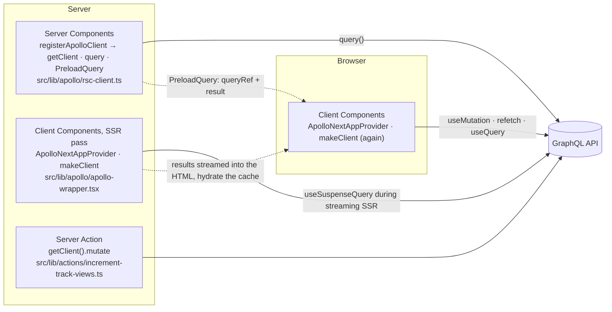

# Reference: the five patterns, the architecture, and the talking points

This is the reference companion to the [tutorial in the README](../README.md). The tutorial tells you what to do; this page tells you why it works and what to say when someone asks.

## The five patterns

| Route         | Pattern                                         | GraphQL request runs                          | HTML contains                     | Browser cache after load            | Mutation                             |
| ------------- | ----------------------------------------------- | --------------------------------------------- | --------------------------------- | ----------------------------------- | ------------------------------------ |
| `/rsc`        | `query()` from `registerApolloClient`           | On the server, during the RSC render          | Finished markup only              | Empty. RSC data never reaches it    | Server Action → `getClient().mutate` |
| `/suspense`   | `useSuspenseQuery` in a Client Component        | On the server during streaming SSR            | Markup + transported result       | Warm and live, no refetch           | `useMutation`                        |
| `/preload`    | `PreloadQuery` → `useSuspenseQuery` / `useReadQuery` | Started in RSC, consumed by Client Components | Markup + transported `queryRef`   | Warm and live, `refetch` available  | `useMutation`                        |
| `/background` | `useBackgroundQuery` + `useReadQuery`           | Server during SSR, like `/suspense`           | Markup + transported result       | Warm and live                       | `useMutation`                        |
| `/legacy`     | `useQuery` (the course way)                     | In the browser, after hydration               | Loading spinner                   | Warm after the client fetch         | `useMutation`                        |
| `/use-cache`     | `query()` inside `"use cache"` (`cacheLife`, `cacheTag`) | On the server, only on a cache miss           | Finished markup, prerendered      | Empty                               | Server Action + `updateTag`          |

Verify it yourself: `curl -s localhost:3000/rsc | grep Cat-stronomy` finds the data, `curl -s localhost:3000/legacy | grep progressbar` finds the spinner.

## How the pieces fit



Two Apollo Client instances exist on purpose:

- **RSC client** (`registerApolloClient`): one instance per request, memoized with React `cache()`, shared by every Server Component and Server Action in that request. Identical queries are deduplicated. `generateMetadata` and the page on `/rsc/track/[trackId]` both call `GetTrack`; only one request leaves the server.
- **Client Components client** (`ApolloNextAppProvider` + `makeClient`): created once on the server for the SSR pass and once in the browser. The integration's `ApolloClient` and `InMemoryCache` subclasses record every result during SSR and stream it into the HTML, so the browser hydrates a warm cache instead of refetching.

Never read the same data from both. RSC data is frozen in the markup, client data keeps updating from the cache, and they will drift.

**Why does a Client Component provider in the root layout not turn `/rsc` into Client Components?** `"use client"` is a boundary in the module import graph, not in the element tree. A Client Component makes the modules it *imports* client modules; whatever it receives as `children` was already rendered by the server and arrives as a slot. The layout is a Server Component that renders `<ApolloWrapper>{children}</ApolloWrapper>`, so the `/rsc` page inside is still a Server Component, and it never touches the provider: it uses `query()` from `registerApolloClient`, a different instance. React context never reaches Server Components at all. The provider exists for the Client Components underneath, at any depth: the pattern pages that call hooks, the `useMutation` inside `TrackGrid`, PreloadQuery's client children.

## Where things live

```
src/
  app/
    layout.tsx                 root layout: fonts, header, ApolloWrapper, footer. force-dynamic
    page.tsx                   index of the patterns
    loading.tsx                route-level Suspense boundary
    error.tsx                  route-level error boundary
    rsc/ suspense/ preload/ background/ legacy/
      page.tsx                 track list for that pattern
      track/[trackId]/page.tsx track detail for that pattern
  lib/
    apollo/rsc-client.ts       registerApolloClient (server-only)
    apollo/apollo-wrapper.tsx  ApolloNextAppProvider ("use client")
    actions/                   Server Action running the mutation
    hooks/                     useMutation wrapper used by client patterns
    patterns.ts                single source of truth for routes and nav
    graphql-uri.ts             endpoint, shared by codegen and both clients
    apollo/links.ts            ErrorLink -> RetryLink -> SetContextLink -> HttpLink, shared by both clients
    apollo/cache.ts            InMemoryCache factory with the Track.isFavorite @client field policy
    apollo/favorites.ts        reactive variable for favorites
    apollo/not-found.ts        maps the API's upstream-404 GraphQL error to notFound()
    search.ts                  parse searchParams, filter, paginate, build hrefs
    hooks/use-debounced-callback.ts
    navigation-types.ts        transition type constants (nav-forward, nav-back) for Link and router.push
    auth/auth.config.ts        Auth.js config the proxy can run: pages, JWT strategy, authorized/jwt/session callbacks
    auth/auth.ts               NextAuth() with the credentials provider: handlers, auth, signIn, signOut
    auth/users.ts              demo user table with a scrypt hash (server-only); demo-account.ts is the public half
    auth/paths.ts              protected prefixes, safe redirect paths, sign-in href
    actions/auth.ts            authenticate (useActionState shape) and signOutAction
    schemas/login.ts           Zod schema shared by the form, the action, and the provider
  proxy.ts                     NextAuth(authConfig).auth, matched to /account and /login only
  types/react-canary.d.ts      pulls in the canary types (ViewTransition) that Next.js's bundled React exports
  components/page-transition.tsx  <ViewTransition> mapping transition types to slide classes; back-link.tsx tags nav-back
  app/login, app/account       sign-in page (Client Component form) and the protected page (auth() again)
  components/user-menu.tsx     auth() in the header, behind Suspense: the per-user hole in the static shell
  app/api/auth/[...nextauth]   Auth.js route handler
  graphql/tracks.graphql       page-level operations
  components/
    track-card.graphql         colocated fragment TrackCard_track
    track-detail.graphql       colocated fragment TrackDetail_track
    *.tsx + *.module.css       presentational components, Server Components unless they need a handler
  __generated__/graphql.ts     codegen output (typescript + typescript-operations + typed-document-node)
```

## Talking points

**Why not one client?** Server Components and Client Components are separate module graphs. Server Components have no React context, so `ApolloProvider` cannot reach them, and a module-level singleton would leak data between requests. `registerApolloClient` solves both with a per-request `cache()`. Client Components need a provider, and the provider needs to run `makeClient` on both sides because the SSR pass and the browser are different processes.

**Why `useSuspenseQuery` instead of `useQuery` in the App Router?** Streaming SSR renders Client Components on the server. A hook that suspends lets the server wait for the data and send finished markup. `useQuery` never suspends, so the server sends the loading state and the browser fetches after hydration: an extra round trip and a spinner on first paint (compare `/legacy` with `/suspense`).

**When to use `PreloadQuery`?** When the data belongs to a Client Component (it must stay live, or it drives interaction) but you want the request to start as early as possible, in RSC, without a waterfall and without a duplicated fetch. The render-prop form hands a `queryRef` to the child, which reads it with `useReadQuery` and gets `refetch`/`fetchMore` from `useQueryRefHandlers` (call it before `useReadQuery`). `useBackgroundQuery` is the client-only version of the same idea.

**Mutations and the cache.** `IncrementTrackViews` selects `track { id numberOfViews }`. The normalized cache identifies `Track:c_0` and updates the field, so every component reading that track re-renders without `refetchQueries` or a manual `update`. On `/rsc` there is no browser cache to update, so the mutation runs in a Server Action with the RSC client. The card awaits the increment before navigating (bounded to two seconds, because `HttpLink` has no timeout), so the detail page does not render a count that is stale by one, and a failed increment is logged instead of becoming an unhandled rejection.

**Forms.** One Zod schema (`src/lib/schemas/register-view.ts`) validates on both sides. `src/components/register-view-form.tsx` posts to a `"use server"` action through `useActionState`: the browser validates first and blocks invalid submits, the action validates again, checks the session, runs the mutation with the RSC client (the session token as per-operation `context`), and calls `revalidatePath`, without which Next.js would not re-render the route (an action that revalidates nothing returns only its value). Without a session the track page shows a sign-in link in the form's place. `useOptimistic` shows the expected count while the action is pending and yields to the re-rendered server value when it settles: React's equivalent of Apollo's `optimisticResponse`, for data that lives on the server instead of in the client cache. On failure nothing is undone by hand: the action revalidates nothing, so the prop never changes and React drops the optimistic value on its own, which is exactly what `optimisticResponse` needs a cache rollback for. `src/components/register-view-client-form.tsx` is the all-client version: the same client validation, then `useMutation` with `optimisticResponse`, `useFragment` reading the `Track` entity live from the normalized cache, and typed errors (`CombinedGraphQLErrors.is`) from the hook. Pick by where the page's data lives: RSC pages post to a Server Action, client-cache pages mutate through Apollo so every reader updates in place.

**Transitions.** `src/components/track-preview.tsx` changes a `useSuspenseQuery`'s variables inside `startTransition`, so the previous result stays on screen (dimmed via `isPending`) instead of the Suspense fallback; a checkbox turns the transition off to show the difference. `src/components/quick-view-button.tsx` calls a Server Action from a plain button inside an async transition and follows it with `router.refresh()`, so `isPending` covers the action and the RSC refresh. The card click, the preload refetch, and the error boundary retry use the same hook.

**View transitions.** React's `<ViewTransition>` (a plain export of `react` in Next.js, which bundles the canary channel; the npm package still hides it, so `src/types/react-canary.d.ts` adds the types and `vitest.setup.ts` shims it) is activated by Transitions, Suspense, and `useDeferredValue`, and App Router navigations are transitions. Four patterns: the card and detail covers share a `name` per track and morph (`src/components/track-card.tsx`, `track-detail.tsx`); the RSC detail page's skeletons exit and its sections enter (`src/app/rsc/track/[trackId]/page.tsx`), though on this branch the route's `loading.tsx` shows first and the page usually lands with its sections resolved, so that reveal is a plain crossfade unless the API is slow; `router.push(href, { transitionTypes })` on the card and `<Link transitionTypes>` on the back link tag navigations as forward or back, and `src/components/page-transition.tsx` maps the types to slide classes on each participating page (pages, never layouts, which persist); the client search keys its results by the deferred query so they crossfade. The morph only pairs when the destination renders in the navigation's commit: pages cached into the static shell (`/use-cache`) do, streamed pages (`/rsc`) and suspending queries (`/suspense`, whose `GetTrack` needs fields the list did not fetch) do not. The header carries `viewTransitionName: "site-header"` and is pinned in CSS. `e2e/view-transitions.spec.ts` records `document.startViewTransition` calls and catches the running animation names with stretched durations.

**URL state versus component state.** `/rsc` keeps search and page in the query string: the Server Component reads `searchParams`, `SearchBox` rewrites the URL with a debounced `router.replace`, `Pagination` is plain links. Shareable, server-readable, works without JavaScript. `/suspense` filters the list already in the browser cache with component state and `useDeferredValue`, dimming stale results. Instant, but invisible to the server. Pick by who needs to know the state.

**Streaming, skeletons, route groups, not found.** `/rsc/track/[trackId]` awaits only `params`; the detail and the "more tracks" strip are async Server Components in separate Suspense boundaries, so both queries run in parallel and stream behind content-shaped skeletons. The list lives in `src/app/rsc/(list)` so its grid-skeleton `loading.tsx` does not wrap the detail route. An unknown id is an HTTP 200 with a GraphQL error carrying the upstream 404 in `extensions.response`; `rethrowAsNotFound` turns it into `notFound()`. Under Cache Components the prerendered shell is already out with a 200, and `dynamicParams` is unavailable, so the not-found UI always renders in place; a route that needs a real 404 status belongs on the classic model.

**Local state.** Favorites live in a reactive variable (`src/lib/apollo/favorites.ts`). `useReactiveVar` reads it directly (card button, header badge) and works on every pattern. `Track.isFavorite @client` is a field policy in `src/lib/apollo/cache.ts` that calls the variable, so fragments can select it and `useFragment` re-renders when it changes; that only works where the entity is in the browser cache. Codegen learns the field from `src/graphql/client-schema.graphql`.

**Link chain.** Both clients use `createLinkChain`: `ErrorLink` observes, `RetryLink` retries transient failures on queries only (never mutations, GraphQL errors, or 4xx), `SetContextLink` sets headers per operation and merges the operation's own `context.headers`, `HttpLink` terminates. The link's `getToken` slot suits a browser client with a token in memory; the RSC client cannot read cookies in a link without dragging every cached and static route that shares it into dynamic rendering, so the Server Action passes the session token as per-operation context instead. The browser client sets no custom headers because each would need CORS approval.

**Authentication.** Auth.js v5 with a credentials provider and a JWT session in an HttpOnly cookie; the Odyssey API ignores the token, so everything enforced is enforced by this app. Three checks, in order of trust: the `authorized` callback in `src/lib/auth/auth.config.ts`, run by `src/proxy.ts` on `/account` and `/login` only, sees the decoded cookie and redirects (optimistic, cheap, runs on prefetches); the `/account` page calls `auth()` again next to the data it renders; and `registerView` calls `auth()` before the mutation and returns state without a session (every `"use server"` export is public). The configuration is split so the proxy never imports the credentials provider (`node:crypto`, the user table). `signIn` runs with `redirect: false` and the action calls `redirect()` itself; wrong credentials are a `CredentialsSignin` error turned into state. The password is verified against a scrypt hash in constant time, the login schema runs in the browser, the action, and the provider, and a `redirectTo` that is not a relative path is dropped. The header's `UserMenu` (`src/components/user-menu.tsx`) calls `auth()` inside a Suspense boundary, so the shell keeps a static **Account** link and the user's name streams in; the `dynamic` branch cannot do that, because a cookie read in the root layout would make every route dynamic there. If `AUTH_SECRET` is unset, `auth()` logs `MissingSecret` and returns `null`: it fails closed.

**Metadata.** `metadataBase` from `NEXT_PUBLIC_SITE_URL`; icons, manifest, and Open Graph images are file conventions in `src/app`. `opengraph-image.tsx` renders with `next/og`; the per-track one is a Route Handler that queries GraphQL through the RSC client.

**Effects.** `src/components/pattern-nav.tsx` measures the active link in `useLayoutEffect` to position a sliding indicator before the browser paints (a hidden-until-measured element makes a plain `useEffect` blink), and subscribes to `resize` in `useEffect` with cleanup. The handler goes through `useEffectEvent` (React 19.2): the subscription is made once, yet it always measures the current pathname. With `measure` as a dependency it would re-subscribe on every navigation; with no dependency and no Effect Event it would measure the first pathname forever. Effect Events are called only from inside effects and never passed around; `src/lib/hooks/use-debounced-callback.ts` is the contrast, a latest-callback ref for a function called from handlers and timers. Nothing else in `src/` needs an effect: data is fetched with Suspense hooks or in Server Components, derived values are computed during render, and work caused by user input happens in the handler.

**Errors.** Suspense hooks and awaited RSC queries throw to the nearest `error.tsx`. `useQuery` returns `error` instead. Passing `errorPolicy: "none"` explicitly narrows `data` to a defined value in TypeScript. The boundary's `retry()` (Next 16.3) re-fetches the segment; `reset()` only re-renders it. One trap: Suspense hooks keep a rejected result in their suspense cache until it auto-disposes (30 s by default), so `retry()` alone re-throws the same error. `error.tsx` refetches the still-watched queries before calling `retry()`; `e2e/error-recovery.spec.ts` proves the recovery by blocking GraphQL during a client-side navigation and lifting the block. In production, errors thrown while rendering Server Components are redacted (React error #441) and only a `digest` reaches the boundary.

**Caching layers.** Apollo's `InMemoryCache` is per instance (per request on the server, per tab in the browser). Next.js adds the fetch Data Cache on top: `HttpLink({ fetchOptions: { next: { revalidate: 60 } } })` or `context.fetchOptions` per query. This branch runs Cache Components (`cacheComponents: true`): nothing is cached unless marked `"use cache"`, every route gets a prerendered shell, and dynamic data streams in under Suspense. Every lever of the model is used once, each where it makes sense:

| Lever | Where | Effect |
| --- | --- | --- |
| `"use cache"` on a page + `cacheLife("minutes")` + `cacheTag` | `src/app/use-cache/page.tsx` | The page's rendered output is cached across requests with a built-in profile |
| `"use cache"` on a function + custom `cacheLife("track")` + `cacheTag` | `src/lib/data/tracks.ts`, profile in `next.config.ts` | The track data is memoized per id; `stale` / `revalidate` / `expire` are explicit |
| `generateStaticParams` | `src/app/use-cache/track/[trackId]/page.tsx` | Every known track page is fully static at build; unknown ids render on demand |
| `connection()` | `src/app/{suspense,background}/layout.tsx`, both `/preload` pages | Force request-time rendering where Next.js cannot detect it: the SSR fetch through the browser-side Apollo link, and `PreloadQuery`'s `crypto.randomUUID()` |
| `<Suspense>` in the shell | `src/components/header.tsx` | `usePathname()` is runtime data inside the shared shell; the links prerender, the active state streams |
| `updateTag` | `src/lib/actions/increment-track-views.ts` | Expire a tag immediately (read-your-own-writes), Server Actions only |
| `revalidatePath` | same file | Regenerate the cached list page on its next request; unchanged from the classic model |
| `revalidateTag(tag, "max")` | `src/app/api/revalidate/route.ts` | Stale-while-revalidate from a webhook-style route handler; the profile argument is required in Next 16 |
| `"use cache: private"` / `"use cache: remote"` | not used | For scopes that must read request data, and for a platform-provided cache handler |
| `instant = false` | not used | Migration aid: lets a segment block while you convert it; not a rendering mode |

What the model removed compared with the `dynamic` branch: the route segment configs (`dynamic`, `revalidate`, `fetchCache`) are build errors, and fetch-level `next.revalidate` / `next.tags` move into `"use cache"` scopes.

**Codegen and fragments.** Operations live in `.graphql` files. Each component owns a fragment named `Component_prop` and the page query spreads it, so the query mirrors the component tree. Codegen emits typed documents; hooks infer `data` from them, never from manual generics. Apollo's data masking (`dataMasking: true` + `useFragment`) is deliberately off: masking is unmasked through the client cache, and the same presentational components render RSC data here, which never enters that cache.

**`@defer`.** If a query uses `@defer`, the SSR pass would render partial data while the request keeps streaming. Wrap the SSR link in `SSRMultipartLink` (strip or accumulate) or use `PreloadQuery` with `useReadQuery`, which transports deferred chunks fully. Not needed for this schema.

**Testing.** Unit tests cover presentational components and the mutation hook with `MockedProvider` from `@apollo/client/testing/react`, asserting on the cache after the mutation. Async Server Components cannot be unit-tested with Vitest, so `e2e/patterns.spec.ts` proves the pattern differences in a real browser: the server-rendered routes contain the data in their HTML while `/legacy` contains the spinner, `/suspense` makes zero browser GraphQL requests while `/legacy` makes one, the Server Action increments the view count, and the `queryRef` refetch picks up a server-side change.

## What changed from the course app

- React Router → App Router file routes, `next/link`, `PageProps`/`LayoutProps` typed params, `typedRoutes`.
- Apollo Client 3 → 4: hooks import from `@apollo/client/react`, `link: new HttpLink()` instead of the `uri` shorthand, `ErrorLike` replaces `ApolloError`, `rxjs` peer dependency, `MockedProvider` moves to `@apollo/client/testing/react`.
- `client-preset` and `gql()` → `.graphql` documents with `typed-document-node`, following the Apollo Client 4 skill.
- Emotion and `@apollo/space-kit` → CSS Modules, `next/font` (Source Sans 3, Source Code Pro), inlined space-kit icons. Every component that has no handler is a Server Component.
- `` → `next/image` with `remotePatterns` for Cloudinary and Unsplash.

## Known quirks

- **`Warning: fragment with name TrackDetail_track already exists`** in the console on `/preload` pages. `@apollo/client-react-streaming` revives a transported query with `gql(print(gql(options.query)))`; graphql-tag registers the fragment once from the compact string and once from the pretty-printed one and warns. Cosmetic, upstream, only for documents with fragments. It shows in the server log and in the browser console.
- Unknown track ids: the Odyssey API is Apollo Server over a REST service, so an unknown id is an HTTP 200 carrying a GraphQL error whose `extensions.response.status` is 404. `src/lib/apollo/not-found.ts` maps that to `notFound()`.
- `ViewTransition` exists in the React that Next.js bundles (canary) but not in the npm `react` 19.2 that Vitest resolves. `vitest.setup.ts` mocks `react` to add a pass-through `ViewTransition`; everything else stays the real module.
- Auth.js refreshes the session cookie whenever it reads one, so a page that calls `auth()` can re-set the cookie from a response still in flight. The rollback test in `e2e/forms.spec.ts` waits for the stream to finish before clearing the cookie, and asserts the session is gone before submitting.
- Vitest cannot load `next-auth` through Node's resolver (it imports `next/server` without an extension), so `vitest.config.mts` inlines it. Tests that only need the action mock `@/lib/auth/auth` anyway.
